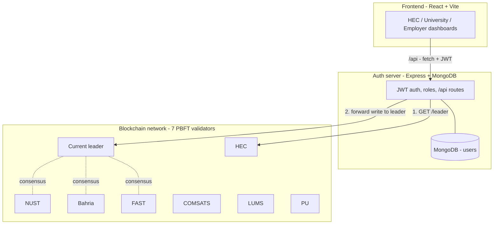
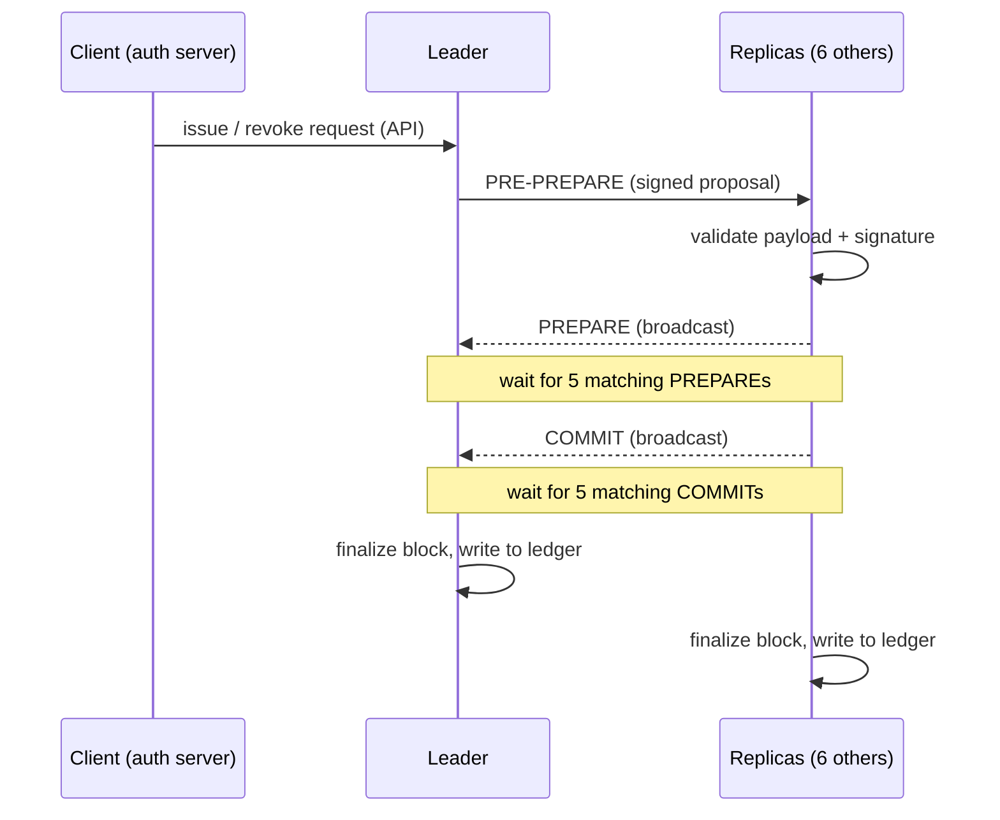

# Truvex


A permissioned blockchain for academic credential verification, built from scratch around a real implementation of **PBFT (Practical Byzantine Fault Tolerance)** consensus — with a full-stack web application on top.

Seven validators, modeled on HEC and major Pakistani universities, independently agree on which academic credentials are valid before any record is considered final. No single institution's database is the source of truth. If up to 2 of the 7 validators are compromised, lie, or go offline, the network still reaches correct, agreed-upon decisions.

On top of the consensus engine sits a role-based web app: universities and HEC **issue** credentials, HEC **revokes** fraudulent ones, and employers **verify** any credential against the network — all through authenticated dashboards.

---

## Table of contents

- [The problem this solves](#the-problem-this-solves)
- [Why PBFT, not Proof of Work](#why-pbft-not-proof-of-work)
- [System architecture](#system-architecture)
- [The validator set](#the-validator-set)
- [How consensus works](#how-consensus-works)
- [Leader discovery](#leader-discovery)
- [Roles and permissions](#roles-and-permissions)
- [Repository structure](#repository-structure)
- [Getting started](#getting-started)
- [Running the full stack](#running-the-full-stack)
- [Configuration](#configuration)
- [API reference](#api-reference)
- [Adversarial testing](#adversarial-testing)
- [Threat model](#threat-model)
- [Tech stack](#tech-stack)
- [Deployment status](#deployment-status)
- [Roadmap](#roadmap)

---

## The problem this solves

Verifying a degree today usually means contacting the issuing university directly, or going through HEC's manual process. Both are slow, and both concentrate trust in a single party. If one university's records system is compromised, a fraudulent degree can be "verified" with no independent check.

Truvex models a network where a small set of trusted institutions jointly sign off on every credential. No single validator can unilaterally fake or hide a record, because the rest of the network would never reach consensus on it.

## Why PBFT, not Proof of Work

This is a **permissioned** network: validators are a known, fixed set of institutions, not anonymous miners. That is exactly the use case PBFT was designed for — fast, deterministic finality among a small group of mutually distrustful but identifiable parties, the same model used by systems like Hyperledger Fabric.

With **N = 7** validators, the network tolerates **f = 2** faulty or malicious validators (N ≥ 3f + 1), and requires a **quorum of 5** matching votes before any decision is trusted. Any two quorums of 5 out of 7 validators must overlap by at least 3, and since at most 2 can be dishonest, at least one validator in that overlap is guaranteed honest. That guarantee is what makes it mathematically impossible for the network to finalize two conflicting versions of the same block.

## System architecture

Truvex is three layers. The browser only ever talks to the auth server; the auth server is the only thing that talks to the blockchain.



- **Frontend (`client/`)** — a React 19 + Vite + Tailwind app. Three role-based dashboards behind a login, styled with a serif/sans identity (Fraunces + Inter). The dev server proxies `/api` to the auth server.
- **Auth server (`server/`)** — Express + MongoDB (via Mongoose) + JWT. Authenticates users, enforces role-based permissions, and acts as the gateway to the blockchain. It never exposes validator ports to the browser.
- **Blockchain network (`src/`, `start-node.js`)** — seven independent validator processes running PBFT consensus over a WebSocket mesh, each with its own signing key and its own persisted ledger.

## The validator set

| Validator | WebSocket port | HTTP API port |
|---|---|---|
| HEC | 5001 | 6001 |
| NUST | 5002 | 6002 |
| Bahria | 5003 | 6003 |
| FAST | 5004 | 6004 |
| COMSATS | 5005 | 6005 |
| LUMS | 5006 | 6006 |
| PU | 5007 | 6007 |

Each validator has a secp256k1 keypair (`keys/`). Public keys are shared in the validator registry; private keys are git-ignored. Every consensus message is signed and verified against this registry before it is trusted.

## How consensus works

A credential action (issue or revoke) becomes final only after two rounds of signed voting, each needing a quorum of 5.



1. **Pre-prepare** — the current leader proposes a credential action, signs it, and broadcasts it.
2. **Prepare** — every validator that receives and validates the proposal broadcasts a signed prepare vote. Each validator waits for **5 matching votes** before proceeding.
3. **Commit** — once prepare quorum is reached, validators broadcast a signed commit vote. Once **5 matching commits** are reached, the block is finalized and written to that validator's ledger.
4. **View change** — if the current leader does not propose within a timeout, validators vote to elect the next leader in rotation. Once 5 validators agree, the network moves to the new view (and new leader) automatically.

Every message is signed with the sender's private key and verified against the validator registry. A forged or tampered message is discarded immediately.

## Leader discovery

Only the **current leader** accepts new proposals, and leadership rotates on view change. So the auth server does not assume a fixed leader — before every write it asks the network who the leader is:

1. Auth server calls `GET /leader` on a validator, which returns the current `leaderId` and its `leaderIndex` (1–7).
2. Auth server forwards the `issue` / `revoke` request to that leader's API.

Reads (`verify`, `list`) can hit any validator, since every ledger is identical once consensus finalizes a block. This keeps writes working correctly even after the leader rotates.

## Roles and permissions

| Role | Can issue | Can revoke | Can verify | Notes |
|---|:---:|:---:|:---:|---|
| **HEC** | ✅ | ✅ | ✅ | Full credential authority; only role that can revoke |
| **University** | ✅ | ❌ | ✅ | Issues under its own institution name |
| **Employer** | ❌ | ❌ | ✅ | Read-only: verify and browse the ledger |

Authentication is JWT-based (7-day tokens, bcrypt-hashed passwords). Account creation (`/register`) is restricted to HEC administrators, so no one can self-assign a privileged role.

Seeded demo accounts (see `server/seed.js`), all with password `password123`:

| Username | Role | Institution |
|---|---|---|
| `hec_admin` | hec | — |
| `nust_admin` | university | NUST |
| `acme_corp` | employer | — |

## Repository structure

```
truvex/
├── src/                      # PBFT blockchain core
│   ├── identity/             # secp256k1 keypairs, signing, verification
│   ├── network/              # P2P mesh + validator registry
│   ├── consensus/            # pre-prepare, prepare, commit, view-change, state
│   ├── credentials/          # issue/revoke payload validation
│   ├── ledger/               # persistent per-validator credential storage
│   └── api/                  # validator HTTP API (issue, verify, revoke, list, leader)
├── server/                   # Auth backend (Express + MongoDB + JWT)
│   ├── models/               # User schema
│   ├── middleware/           # JWT auth + role guards
│   ├── routes/               # auth + credential gateway routes
│   └── seed.js               # demo account seeding
├── client/                   # React + Vite frontend
│   └── src/pages/            # Login, Landing, HEC / University / Employer dashboards
├── keys/                     # Per-validator keypairs (private keys git-ignored)
├── start-node.js             # Entry point for a single validator
├── start-network.js          # Launches all 7 validators
├── start-all.ps1             # Launches blockchain + auth server + frontend (Windows)
├── attacker.js               # Adversarial test: signature forgery
├── malicious-leader.js       # Adversarial test: conflicting proposals
├── Dockerfile
└── docker-compose.yml        # Runs all 7 validators as isolated containers
```

## Getting started

**Prerequisites**

- Node.js 22+
- MongoDB running locally (Community Server, as a service, on `mongodb://localhost:27017`)

**Install and prepare**

```bash
# Blockchain core deps + validator keys
npm install
node generate-keys.js

# Auth server deps + demo accounts
cd server
npm install
node seed.js
cd ..

# Frontend deps
cd client
npm install
cd ..
```

Create `server/.env` (see [Configuration](#configuration)) before seeding or running the auth server.

## Running the full stack

**Option 1 — one command (Windows).** Launches the blockchain network, auth server, and frontend, each in its own window:

```powershell
powershell -ExecutionPolicy Bypass -File .\start-all.ps1
```

Then open the Vite URL it prints (usually `http://localhost:5173`) and log in with a seeded account.

**Option 2 — manually, in three terminals:**

```bash
# Terminal 1 - blockchain
node start-network.js

# Terminal 2 - auth server
cd server && node index.js

# Terminal 3 - frontend
cd client && npm run dev
```

**Option 3 — blockchain via Docker.** Runs all 7 validators as isolated containers on Docker's internal network, closer to how independently operated institutional nodes would run:

```bash
docker compose up --build
```

## Configuration

The auth server reads `server/.env` (git-ignored):

| Variable | Description |
|---|---|
| `PORT` | Auth server port (the frontend proxies `/api` here — default `7000`) |
| `MONGO_URI` | Mongo connection string, e.g. `mongodb://localhost:27017/truvex` |
| `JWT_SECRET` | Secret used to sign JWTs |
| `BLOCKCHAIN_API_BASE` | Base URL for validator APIs, ending so that appending a node number `1`–`7` targets ports `6001`–`6007` (e.g. `http://localhost:600`) |

Validator hostnames can be overridden with `HEC_HOST`, `NUST_HOST`, etc. (used by Docker Compose); they default to `localhost`.

## API reference

**Auth API** (`server/`, base `/api`, JWT required except login):

| Method | Endpoint | Role | Description |
|---|---|---|---|
| POST | `/api/auth/login` | public | Log in, returns a JWT |
| POST | `/api/auth/register` | hec | Create a new account |
| POST | `/api/credentials/issue` | hec, university | Issue a credential (routed to the leader) |
| POST | `/api/credentials/revoke` | hec | Revoke a credential (routed to the leader) |
| GET | `/api/credentials/verify/:id` | any | Look up a credential's status |
| GET | `/api/credentials/list` | any | List all credentials on the ledger |

**Validator API** (`src/api/`, ports `6001`–`6007`):

| Method | Endpoint | Description |
|---|---|---|
| POST | `/issue-credential` | Propose a new credential (leader only) |
| POST | `/revoke-credential` | Propose revoking a credential (leader only) |
| GET | `/verify-credential/:id` | Read a credential's current status |
| GET | `/credentials` | Return all credentials from this node's ledger |
| GET | `/leader` | Return the current leader and its index |

## Adversarial testing

**`attacker.js` — signature forgery.** Connects to a live validator and sends a message claiming to be from HEC, signed with a different private key. The network rejects it on signature verification.

**`malicious-leader.js` — lying leader.** Uses HEC's real private key to send two different, both validly-signed proposals to different halves of the network. Because no group of 5 validators can agree on either conflicting version, prepare quorum is never reached. The network stalls rather than finalizing a lie.

## Threat model

**Defends against:**

- Up to 2 of 7 validators being compromised, lying, or going silent
- Forged or impersonated messages from outside the validator set
- A malicious leader sending inconsistent proposals to split the network
- Tampering with message content after signing
- Privilege escalation via self-registration (account creation is HEC-only)

**Does not defend against:**

- Collusion of 3 or more validators — beyond the 3f + 1 bound, the guarantee no longer holds. This is a known, accepted limit of PBFT at this validator count.
- Private key compromise — an attacker with a validator's actual private key can sign as that validator. Key custody is outside this system's scope.
- Real-world identity binding — the system assumes the registered public key for "NUST" genuinely belongs to NUST. Verifying that binding initially is an operational problem, not a cryptographic one.

## Tech stack

**Blockchain:** Node.js, native crypto (secp256k1), `ws` (WebSocket P2P), Express.
**Auth server:** Express 5, Mongoose (MongoDB), JSON Web Tokens, bcrypt.
**Frontend:** React 19, Vite, Tailwind CSS 4, React Router.
**Infra:** Docker, Docker Compose.

## Deployment status

The 7-node network has been deployed and tested across separate cloud services (Railway), confirming real network-level Byzantine fault tolerance beyond a single-machine simulation. 3 independent services were verified mutually connected and reaching consensus before hitting free-tier infrastructure limits. Full 7-node continuous cloud deployment is pending infrastructure budget; the complete system runs locally via Docker Compose in the meantime.

## Roadmap

- Multi-node leader discovery fallback, so writes survive even if the queried node is the one that went down.
- Persist a durable block counter so block numbers continue across restarts.
- Automated test suite for consensus and the API layer.
- Redesign the login and landing pages to match the dashboard identity.
- Full 7-node continuous cloud deployment.
